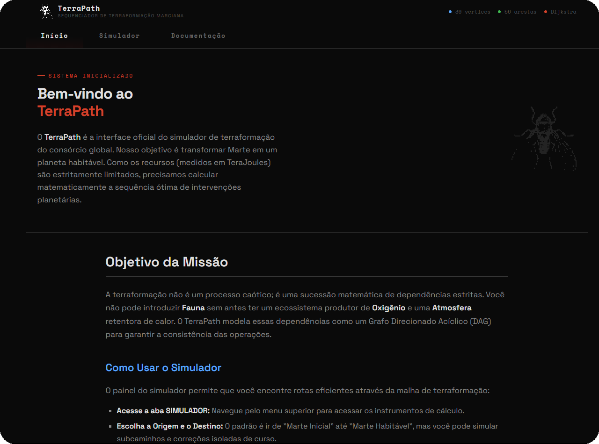
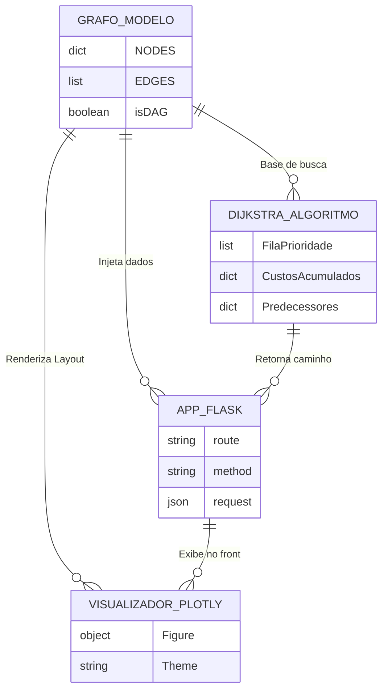

<h1 align="center">
  
  &nbsp;TerraPath
</h1>
<p align="center">Sequenciador de Terraformação Marciana — Global Solution FIAP 2026</p>
<p align="center">
  <a href="https://github.com/GrupoMoskitto/dynamic-programming-gs-2026-1s/actions/workflows/deploy.yml"></a>&nbsp;
  <a href="https://github.com/GrupoMoskitto/dynamic-programming-gs-2026-1s"></a>&nbsp;
  <a href="https://github.com/GrupoMoskitto/dynamic-programming-gs-2026-1s"></a>&nbsp;
  <a href="https://github.com/GrupoMoskitto/dynamic-programming-gs-2026-1s"></a>
</p>

<br>

<a href="https://github.com/GrupoMoskitto/dynamic-programming-gs-2026-1s">
  
</a>

---

### Sobre

O **TerraPath** é uma plataforma web que simula, otimiza e sequencia etapas para a terraformação do planeta Marte utilizando a **Teoria dos Grafos** e a técnica de **Programação Dinâmica** (Algoritmo de Dijkstra otimizado). 

A aplicação atua como o cérebro logístico da colonização marciana, modelando a evolução do planeta vermelho desde seu estado inicial (frio e inóspito) até a criação de uma biosfera habitável, calculando rotas logísticas de forma inteligente.

**Funcionalidades Estratégicas:**

- **Grafo Acíclico Direcionado (DAG):** Modelagem rigorosa de 39 estágios tecnológicos e 56 transições de evolução planetária.
- **Dijkstra Otimizado:** Uso de *Min-Heap* (Fila de Prioridades) garantindo complexidade $\mathcal{O}((V + E) \log V)$ na busca da sequência ótima.
- **Múltiplos Critérios de Otimização:** O usuário pode escolher simular rotas focando no menor custo de *Energia (Tera-Joules)*, menor *Tempo (Etapas)* ou mitigação de *Riscos*.
- **Visualização Matemática Interativa:** Renderização gráfica com Plotly e Cytoscape, atrelada à apresentação matemática das equações com MathJax nativo.

---

### Stack

| Camada | Tecnologia |
| --- | --- |
| **Backend** | Python 3.12 · Flask · Jinja2 |
| **Estrutura de Grafos** | NetworkX |
| **Frontend** | HTML5 · CSS3 (Vanilla) · JavaScript |
| **Visualização de Dados** | Plotly · Cytoscape.js · MathJax (LaTeX) |
| **Geração de Relatórios** | ReportLab (PDF Export) |
| **Infra & DevOps** | GitHub Actions (CI/CD) · Frozen-Flask |
| **Testes de Qualidade** | Pytest |

---

### Quick Start

```bash
# Clone o repositório
git clone https://github.com/GrupoMoskitto/dynamic-programming-gs-2026-1s.git
cd dynamic-programming-gs-2026-1s

# Crie e ative o ambiente virtual
python3 -m venv .venv
source .venv/bin/activate  # (No Windows: .venv\Scripts\activate)

# Instale as dependências
pip install -r requirements.txt

# Inicie o Servidor Flask
python3 app.py
```

> [!TIP]
> A aplicação roda nativamente na porta `5000`. Acesse `http://localhost:5000` no seu navegador para abrir a interface espacial.

---

### Acesso Online (GitHub Pages)

O ambiente do simulador (UI e Documentação) está hospedado de forma estática no GitHub Pages para facilitar a avaliação visual:

- **Acessar Projeto:** [grupomoskitto.github.io/dynamic-programming-gs-2026-1s](https://grupomoskitto.github.io/dynamic-programming-gs-2026-1s)

> [!WARNING]
> Como o GitHub Pages não roda backend em Python (apenas sites estáticos), o cálculo dinâmico do simulador de roteamento só funcionará executando a aplicação localmente. Para usar o motor do Dijkstra, veja a seção **[Quick Start](#quick-start)** acima.

---

### Documentação Visual

#### Arquitetura de Classes e Componentes


> [!NOTE]
> O diagrama demonstra como a lógica da pasta `core/` atua como o motor central independentemente das rotas web do Flask.

---

### Scripts

| Comando | Descrição |
| --- | --- |
| `python3 app.py` | Inicia o servidor backend Flask e a interface web. |
| `pytest tests/` | Roda toda a suíte de testes unitários da matemática e rotas. |
| `python3 freeze.py` | Congela a aplicação Flask em HTML Estático na pasta `build/`. |

---

### Critérios de Simulação (Regras do Algoritmo)

| Critério | Descrição | Prioridade |
| --- | --- | --- |
| **Energia** | Prioriza o caminho utilizando a menor quantidade de **Tera-Joules** possível nas transições do grafo. | Máxima |
| **Etapas** | Otimiza para um *Caminho Mínimo* (Shortest Path) saltando pela menor quantidade de vértices até o destino. | Alta |
| **Risco** | Escala um coeficiente de risco probabilístico na travessia das arestas (ideal para cenários inseguros). | Alta |

---

### Equipe

| Nome | RM | GitHub | LinkedIn |
| --- | --- | --- | --- |
| **Gabriel Couto Ribeiro** | RM559579 | [](https://github.com/rouri404) | [](https://www.linkedin.com/in/gabricouto/) |
| **Gabriel Kato Peres** | RM560000 | [](https://github.com/kato8088) | [](https://www.linkedin.com/in/gabrikato/) |
| **João Vitor de Matos Araujo** | RM559246 | [](https://github.com/joaomatosq) | [](https://www.linkedin.com/in/joaomatosq/) |
| **Marcelo Affonso Fonseca** | RM559790 | [](https://github.com/marcelo215) | [](https://www.linkedin.com/in/marcelo-affonso-fonseca-899682333/) |
| **Belton Lee Carr De Muzio Meira** | RM560760 | [](https://github.com/BeltonLeeMeira) | [](https://www.linkedin.com/in/belton-meira-080a09326/) |
